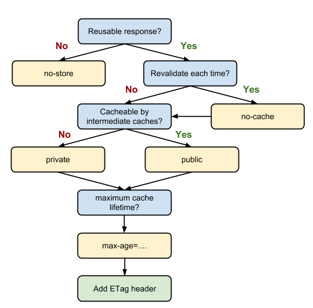

### **缓存**

#### **按缓存位置分类**

它们的优先级是：(由上到下寻找，找到即返回；找不到则继续)

1. Service Worker
2. Memory Cache
3. Disk Cache
4. 网络请求

**Service Worker**
我们可以从 Chrome 的 F12 中，Application -> Cache Storage 找到这个单独的“小金库”。除了位置不同之外，这个缓存是永久性的，即关闭 TAB 或者浏览器，下次打开依然还在(而 memory cache 不是)。有两种情况会导致这个缓存中的资源被清除：手动调用 API cache.delete(resource) 或者容量超过限制，被浏览器全部清空。

如果 Service Worker 没能命中缓存，一般情况会使用 fetch() 方法继续获取资源。这时候，浏览器就去 memory cache 或者 disk cache 进行下一次找缓存的工作了。注意：经过 Service Worker 的 fetch() 方法获取的资源，即便它并没有命中 Service Worker 缓存，甚至实际走了网络请求，也会标注为 from ServiceWorker

**Memory Cache**
memory cache 是内存中的缓存，(与之相对 disk cache 就是硬盘上的缓存)。按照操作系统的常理：先读内存，再读硬盘。disk cache 将在后面介绍 (因为它的优先级更低一些)，这里先讨论 memory cache。

几乎所有的网络请求资源都会被浏览器自动加入到 memory cache 中。但是也正因为数量很大但是浏览器占用的内存不能无限扩大这样两个因素，memory cache 注定只能是个“短期存储”。常规情况下，浏览器的 TAB 关闭后该次浏览的 memory cache 便告失效 (为了给其他 TAB 腾出位置)。而如果极端情况下 (例如一个页面的缓存就占用了超级多的内存)，那可能在 TAB 没关闭之前，排在前面的缓存就已经失效了。

* preloader：在浏览器打开网页的过程中，会先请求 HTML 然后解析。之后如果浏览器发现了 js, css 等需要解析和执行的资源时，它会使用 CPU 资源对它们进行解析和执行。在古老的年代(大约 2007 年以前)，“请求 js/css - 解析执行 - 请求下一个 js/css - 解析执行下一个 js/css” 这样的“串行”操作模式在每次打开页面之前进行着。很明显在解析执行的时候，网络请求是空闲的，这就有了发挥的空间：我们能不能一边解析执行 js/css，一边去请求下一个(或下一批)资源呢？这就是 preloader 要做的事情。不过 preloader 没有一个官方标准，所以每个浏览器的处理都略有区别。例如有些浏览器还会下载 css 中的 @import 内容或者\<video>的 poster等。而这些被 preloader 请求够来的资源就会被放入 memory cache 中，供之后的解析执行操作使用。
 
* preload： 例如 <link rel="preload">。这些显式指定的预加载资源，也会被放入 memory cache 中。
  
memory cache 机制保证了一个页面中如果有两个相同的请求 (例如两个 src 相同的 ，两个 href 相同的 <link>)都实际只会被请求最多一次，避免浪费。

在从 memory cache 获取缓存内容时，浏览器会忽视例如 max-age=0, no-cache 等头部配置。例如页面上存在几个相同 src 的图片，即便它们可能被设置为不缓存，但依然会从 memory cache 中读取。这是因为 memory cache 只是短期使用，大部分情况生命周期只有一次浏览而已。而 max-age=0 在语义上普遍被解读为“不要在下次浏览时使用”，所以和 memory cache 并不冲突。

如果不想让一个资源进入缓存，就连短期也不行，那就需要使用 no-store。存在这个头部配置的话，即便是 memory cache 也不会存储，自然也不会从中读取了。

**disk cache**
disk cache 也叫 HTTP cache，顾名思义是存储在硬盘上的缓存，因此它是持久存储的，是实际存在于文件系统中的。而且它允许相同的资源在跨会话，甚至跨站点的情况下使用，例如两个站点都使用了同一张图片。

disk cache 会严格根据 HTTP 头信息中的各类字段来判定哪些资源可以缓存，哪些资源不可以缓存；哪些资源是仍然可用的，哪些资源是过时需要重新请求的。当命中缓存之后，浏览器会从硬盘中读取资源，虽然比起从内存中读取慢了一些，但比起网络请求还是快了不少的。绝大部分的缓存都来自 disk cache。

凡是持久性存储都会面临容量增长的问题，disk cache 也不例外。在浏览器自动清理时，会有神秘的算法去把“最老的”或者“最可能过时的”资源删除，因此是一个一个删除的。不过每个浏览器识别“最老的”和“最可能过时的”资源的算法不尽相同，可能也是它们差异性的体现。

**请求网络**

如果一个请求在上述 3 个位置都没有找到缓存，那么浏览器会正式发送网络请求去获取内容。之后容易想到，为了提升之后请求的缓存命中率，自然要把这个资源添加到缓存中去。具体来说：

1. 根据 Service Worker 中的 handler 决定是否存入 Cache Storage (额外的缓存位置)。
2. 根据 HTTP 头部的相关字段(Cache-control, Pragma 等)决定是否存入 disk cache
3. memory cache 保存一份资源的引用，以备下次使用。
   
####　**按失效策略分类**

**强制缓存**

强制缓存的含义是，当客户端请求后，会先访问缓存数据库看缓存是否存在。如果存在则直接返回；不存在则请求真的服务器，响应后再写入缓存数据库。

强制缓存直接减少请求数，是提升最大的缓存策略。 它的优化覆盖了文章开头提到过的请求数据的全部三个步骤。如果考虑使用缓存来优化网页性能的话，强制缓存应该是首先被考虑的。

可以造成强制缓存的字段是 **Cache-control** 和 **Expires**，Cache-control 的优先级高于 Expires。
```
Expires: Thu, 10 Nov 2017 08:45:11 GMT
Cache-control: max-age=2592000
```
* **Expires**:表示缓存到期时间，是一个绝对的时间 (当前时间+缓存时间)。在响应消息头中，设置这个字段之后，就可以告诉浏览器，在未过期之前不需要再次请求。这个字段设置时有两个缺点：
  1. 由于是绝对时间，用户可能会将客户端本地的时间进行修改，而导致浏览器判断缓存失效，重新请求该资源。此外，即使不考虑自信修改，时差或者误差等因素也可能造成客户端与服务端的时间不一致，致使缓存失效。
  2.  写法太复杂了。表示时间的字符串多个空格，少个字母，都会导致非法属性从而设置失效。
* **Cache-control**:该字段表示资源缓存的最大有效时间(相对时间)，在该时间内，客户端不需要向服务器发送请求。Cache-control 字段常用的值：
    * max-age：即最大有效时间，在上面的例子中我们可以看到
    * must-revalidate：如果超过了 max-age 的时间，浏览器必须向服务器发送请求，验证资源是否还有效。
    * no-cache：虽然字面意思是“不要缓存”，但实际上还是要求客户端缓存内容的，只是是否使用这个内容由后续的对比来决定。
    * no-store: 真正意义上的“不要缓存”。所有内容都不走缓存，包括强制和对比。
    * public：所有的内容都可以被缓存 (包括客户端和代理服务器， 如 CDN)
    * private：所有的内容只有客户端才可以缓存，代理服务器不能缓存。默认值。
    * 
  

**协商缓存（对比缓存）**

协商缓存在请求数上和没有缓存是一致的，但如果是 304 的话，返回的仅仅是一个状态码而已，并没有实际的文件内容，因此 在响应体体积上的节省是它的优化点。它的优化覆盖了文章开头提到过的请求数据的三个步骤中的最后一个：“响应”。通过减少响应体体积，来缩短网络传输时间。所以和强制缓存相比提升幅度较小，但总比没有缓存好。

* **Last-Modified & If-Modified-Since**
  1. 服务器通过 Last-Modified 字段告知客户端，资源最后一次被修改的时间，例如
     ```
     Last-Modified: Mon, 10 Nov 2018 09:10:11 GMT
     ```
  2. 浏览器将这个值和内容一起记录在缓存数据库中
  3. 下一次请求相同资源时时，浏览器从自己的缓存中找出“不确定是否过期的”缓存。因此在请求头中将上次的 Last-Modified 的值写入到请求头的 If-Modified-Since 字段
  4. 服务器会将 If-Modified-Since 的值与 Last-Modified 字段进行对比。如果相等，则表示未修改，响应 304；反之，则表示修改了，响应 200 状态码，并返回数据。
  
  缺点：
  * 如果资源更新的速度是秒以下单位，那么该缓存是不能被使用的，因为它的时间单位最低是秒。
  * 如果文件是通过服务器动态生成的，那么该方法的更新时间永远是生成的时间，尽管文件可能没有变化，所以起不到缓存的作用。

* **Etag & If-None-Match**

为了解决上述问题，出现了一组新的字段 Etag 和 If-None-Match。

Etag 存储的是文件的特殊标识(一般都是 hash 生成的)，服务器存储着文件的 Etag 字段。之后的流程和 Last-Modified 一致，只是 Last-Modified 字段和它所表示的更新时间改变成了 Etag 字段和它所表示的文件 hash，把 If-Modified-Since 变成了 If-None-Match。服务器同样进行比较，命中返回 304, 不命中返回新资源和 200。

Etag 的优先级高于 Last-Modified


**缓存小结**

1. 调用 Service Worker 的 fetch 事件响应
2. 查看 memory cache
3. 查看 disk cache。这里又细分：
   1. 如果有强制缓存且未失效，则使用强制缓存，不请求服务器。这时的状态码全部是 200
   2. 如果有强制缓存但已失效，使用对比缓存，比较后确定 304 还是 200
4. 发送网络请求，等待网络响应
5. 把响应内容存入 disk cache (如果 HTTP 头信息配置可以存的话)
6. 把响应内容 的引用 存入 memory cache (无视 HTTP 头信息的配置)
7. 把响应内容存入 Service Worker 的 Cache Storage (如果 Service Worker 的脚本调用了 cache.put())